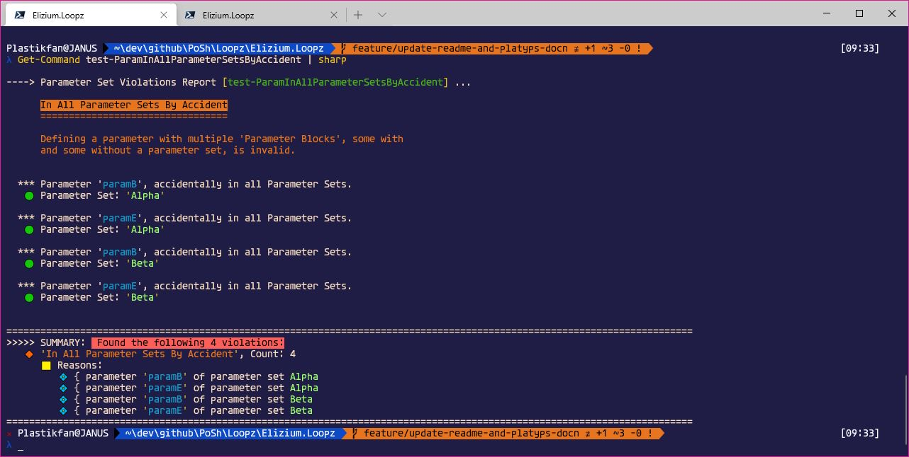
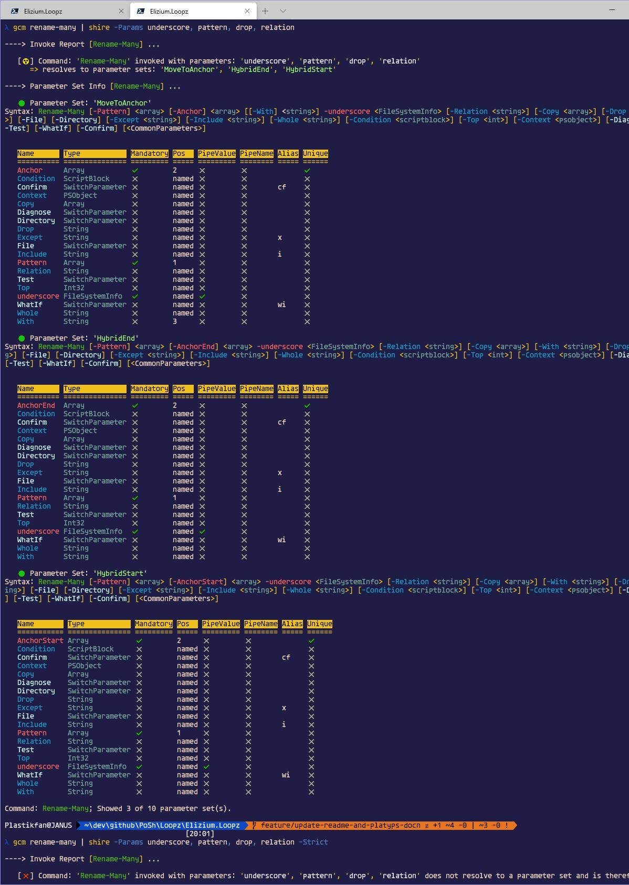
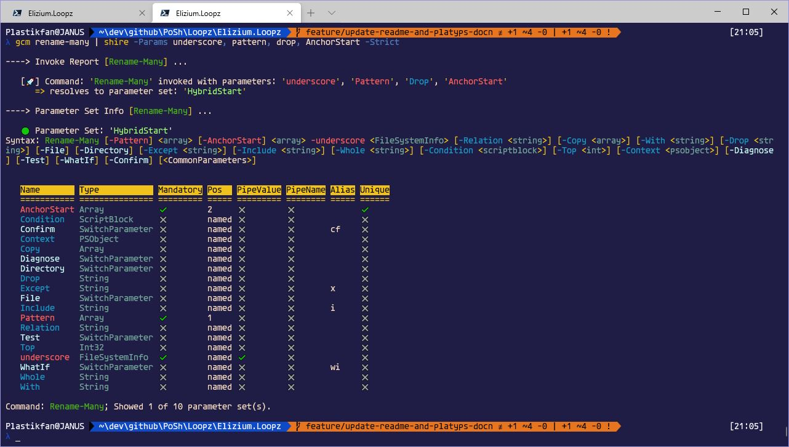

# :nazar_amulet: Elizium.Loopz Parameter Set Tools

---

## Using the Parameter Set Tools

There are 3 commands that comprise the parameter set tools, the first is a general query command and the others are reports that show violations/problems.

| Command Name              | Alias | Description
|---------------------------|-------|-------------------------------------------------------
| Show-ParameterSetInfo     | ships [:heavy_check_mark:](#using.show-parameter-set-info) | Show general parameter set info including syntax statement for all of a command's parameter sets |
| Show-ParameterSetReport   | sharp [:heavy_check_mark:](#using.show-parameter-set-report) | For a given command, show all parameter set violations |
| Show-InvokeReport         | shire [:heavy_check_mark:](#using.show-invoke-report) | Given a set of parameters, determine which (if any) which parameter sets could be resolved to |

Parameter Set Tool Classes

| Class Name                | Description
|---------------------------|--------------------------------------------------------------------------
| DryRunner                 | [:heavy_check_mark:](#dry-runner.class) Used by Show-InvokeReport
| RuleController            | [:heavy_check_mark:](#rule-controller.class) Used by DryRunner
| Syntax                    | [:heavy_check_mark:](#syntax.class) Used by all parameter set tool commands

<div id="using.show-parameter-set-info"></div>

### Show-ParameterSetInfo

:dart: using *Show-ParameterSetInfo (ships)*

Show all the parameter information for a command. For brevity, this example supplies the names of some parameter sets (via the *Sets* parameter), otherwise all parameter sets would be shown which in this case would be rather verbose.

> $ Get-Command 'Rename-Many' | ships -Sets UpdateInPlace, NoReplacement


<div id="using.show-parameter-set-report"></div>

### Show-ParameterSetReport

:dart: using *Show-ParameterSetReport (sharp)*

**Does a command satisfy all parameter set rules? If not, which rules does it violate and why?**. These are the questions that this command answers. For a command that is well defined, we expect no violations to be reported as illustrated in the following example:

> $ Get-Command 'Rename-Many' | sharp


However, there are currently 4 rules that could be violated and these are illustrated next.

+ 1) :x: *Must Contain Unique Set Of Params*
No two parameter sets can contain exactly the same set of parameters.

:anger: Given the following problematic function definition:

```powershell
  function test-WithDuplicateParamSets {
    param(
      [Parameter()]
      [object]$Chaff,

      [Parameter(ParameterSetName = 'Alpha', Mandatory, Position = 1)]
      [Parameter(ParameterSetName = 'Beta', Mandatory, Position = 11)]
      [object]$DuplicatePosA,

      [Parameter(ParameterSetName = 'Alpha', Position = 2)]
      [Parameter(ParameterSetName = 'Beta', Position = 12)]
      [Parameter(ParameterSetName = 'Delta', Position = 21)]
      [object]$DuplicatePosB,

      [Parameter(ParameterSetName = 'Alpha', Position = 3)]
      [Parameter(ParameterSetName = 'Beta', Position = 13)]
      [Parameter(ParameterSetName = 'Delta', Position = 22)]
      [object]$DuplicatePosC
    )
  }
```

> $ Get-Command test-WithDuplicateParamSets | sharp

results in:


In this example, we can see we have 1 violation. That is, there are two parameter sets 'Alpha' and 'Beta' which have the same set of parameters and therefore can't be disambiguated by PowerShell. Since the 2 parameter sets are equivalent, it goes on to show the parameter set info for the first parameter set only, 'Alpha'.

+ 2) :x: *Must Contain Unique Positions*
Parameters must make unique claims to a position within any single parameter set.

:anger: Given the following problematic function definition:

```powershell
  function test-MultipleSetsWithDuplicatedPositions {
    param(
      [parameter()]
      [object]$Chaff,

      [Parameter(ParameterSetName = 'Alpha', Mandatory, Position = 999)]
      [object]$DuplicatePosA,

      [Parameter(ParameterSetName = 'Alpha', Position = 999)]
      [object]$DuplicatePosB,

      [Parameter(ParameterSetName = 'Alpha', Position = 999)]
      [object]$DuplicatePosC,

      [Parameter(ParameterSetName = 'Beta', Mandatory, Position = 111)]
      [object]$SameA,

      [Parameter(ParameterSetName = 'Beta', Position = 111)]
      [object]$SameB
    )
  }
```

> $ Get-Command test-MultipleSetsWithDuplicatedPositions | sharp

results in:


In this example, we can see that in parameter set 'Alpha', there are 3 parameters 'DuplicatePosA', 'DuplicatePosB' and 'DuplicatePosC' making claim to position 999. In parameter set 'Beta', both 'SameA' and 'SameB' stake a claim to position 111.

+ 3) :x: *Must Not Have Multiple Pipeline Params*

:anger: Given the following problematic function definition:

```powershell
  function test-MultipleClaimsToPipelineValue {
    param(
      [parameter(ValueFromPipeline = $true)]
      [object]$Chaff,

      [Parameter(ParameterSetName = 'Alpha', Mandatory, Position = 1, ValueFromPipeline = $true)]
      [object]$ClaimA,

      [Parameter(ParameterSetName = 'Alpha', Position = 2, ValueFromPipeline = $true)]
      [object]$ClaimB,

      [Parameter(ParameterSetName = 'Alpha', Position = 3, ValueFromPipeline = $true)]
      [object]$ClaimC,

      [Parameter(ParameterSetName = 'Beta', Position = 1, ValueFromPipeline = $true)]
      [object]$ClaimD,

      [Parameter(ParameterSetName = 'Beta', Position = 2, ValueFromPipeline = $true)]
      [object]$ClaimE
    )
  }
```

> $ Get-Command test-MultipleClaimsToPipelineValue | sharp

results in:


There are 2 violations here. In parameter set 'Alpha', there are four parameters defined with *ValueFromPipeline* set to $true and three parameters in parameter set 'Beta', likewise.

+ 4) :x: *Must Not Be In All Parameter Sets By Accident*

This particular rule is meant to guard against an issue that can easily be created by a cut and paste error, where a parameter is defined to be included in some parameter sets but also has a parameter definition ([Parameter()]) that contains no parameter set specification. Parameters can be either in 1 or more parameter sets or can be a member of all parameter sets implicitly, but not at the same time. The presence of:

> [Parameter()]

applied to a parameter means that it is in all parameters and therefore invalids any other explicit parameter set definition for the same parameter.

:anger: So given the following problematic function definition ...:

```powershell
function test-ParamInAllParameterSetsByAccident {
  param(
    [Parameter(ValueFromPipeline = $true)]
    [object]$Chaff,

    [Parameter(ParameterSetName = 'Alpha', Mandatory, Position = 1)]
    [object]$paramA,

    [Parameter()]
    [Parameter(ParameterSetName = 'Alpha', Position = 2)]
    [object]$paramB,

    [Parameter(ParameterSetName = 'Alpha', Position = 3)]
    [object]$paramC,

    [Parameter(ParameterSetName = 'Beta', Position = 1)]
    [object]$paramD,

    [Parameter()]
    [Parameter(ParameterSetName = 'Beta', Position = 2)]
    [object]$paramE
  )
}
```

> $ Get-Command test-ParamInAllParameterSetsByAccident | sharp

results in:



We can see that parameters 'paramB' and 'paramE' are mal-defined because of the rogue *[Parameter()]* statements. The parameter sets are displayed for all parameters mis-defined. The reader should also note that a violation is reported for each parameter mis-defined like this for all parameter sets for the command.

<div id="using.show-invoke-report"></div>

### Show-InvokeReport

:dart: using *Show-InvokeReport (shire)*

**I am having trouble invoking a command. Which parameter set do my invoke parameters resolve to and if ambiguous, what is the set of candidate parameter sets that these parameters could relate to?**

In particular, when this message is seen in the console:

*"Parameter set cannot be resolved using the specified named parameters. One or
more parameters issued cannot be used together or an insufficient number of
parameters were provided."*

it would be nice to get a little more insight into the reason why the supplied parameters are incorrect. This command aims to help in this regard.

When *Show-InvokeReport* is invoked with a valid set of invoke parameters, the command shows which parameter set is resolved to:

> $ Get-Command Rename-Many | Show-InvokeReport -Params underscore, Pattern, Paste


When a user invokes a real command and makes a mistake with the set of parameters on the command line, they can run into the error message quoted previously. The user can mistakenly either provide too many parameters none of which actually resolve to a parameter set or too few. In either case, the user can invoke *Show-InvokeReport* specifying the rogue set and in the case of providing too few parameters it will simply show a message saying so.

Again, using *Rename-Many* as our test command, the following shows 2 difference scenarios, *Strict* and *Weak*. The resolution method used by default is *Weak*. If we supply a set of parameters that is ambiguous; ie resolved to multiple parameter sets you will see the candidates displayed:

> $ gcm Rename-Many | shire -Params underscore, pattern, drop, relation



However, if we use the *Strict* parameter, then the result will be a message indicating the supplied parameters do not resolve to a parameter set. This because the *Strict* mode takes mandatory parameters into account. The resolved candidates will only include those parameter sets whose mandatory parameters are **ALL** present in the provided set of parameters. So, actually, if we supplied a set of parameters which contains all the mandatory parameters of a particular parameter set, with the *Strict* flag set, we should see the resolved set:

> $ gcm rename-many | shire -Params underscore, pattern, drop, AnchorStart -Strict



## Parameter Set Classes

<div id="dry-runner.class"></div>

### Dry Runner Class

The Dry-Runner is used by the Show-InvokeReport command. The DryRunner can also
be used in unit-tests to ensure that expected parameters can be used to
invoke the function without causing errors. In the unit tests, the client just needs
to instantiate the DryRunner using [New-DryRunner](#New-DryRunner.md) then pass in an expected list
of parameters to the Resolve method. The test case can review the result parameter
set(s) and assert as appropriate.

The following example shows how to use the DryRunner in a unit test

```powershell
  Context 'given: a command with parameter sets' {
    Context 'and: valid set of parameters' {
      It 'should: resolve to a single parameter set' {
        [hashtable]$signals = Get-Signals;
        [Scribbler]$scribbler = New-Scribbler -Test;
        [string]$commandName = 'Rename-Many';

        [DryRunner]$runner = New-DryRunner -CommandName $commandName `
          -Signals $signals -Scribbler $scribbler;

        [CommandParameterSetInfo[]]$paramSets = $runner.Resolve(
          @('underscore', 'Pattern', 'Anchor', 'Paste')
        );

        $paramSets.Count | Should -Be 1;
      }
    }
  }
```

<div id="rule-controller.class"></div>

### Rule Controller Class

The RuleController class can be used in unit tests to check that commands do not violate the
parameter set rules.

```powershell
using namespace System.Management.Automation;
using module Elizium.Krayola;

Context 'given: commands under test' {
    It 'should: not violate parameter set rules' {
      [hashtable]$signals = Get-Signals;
      [Scribbler]$scribbler = New-Scribbler -Test;

      [string]$directoryPath = './path-to-folder-with-commands-to-test';
      [array]$files = Get-ChildItem -Path $directoryPath -File -Recurse -Filter '*.ps1';

      foreach ($file in $files) {
        [string]$command = [System.IO.Path]::GetFileNameWithoutExtension($file.Name);
        [CommandInfo]$commandInfo = Get-Command $command -ErrorAction SilentlyContinue;

        if ($commandInfo) {
          [RuleController]$controller = [RuleController]::new($commandInfo);
          [syntax]$syntax = New-Syntax -CommandName $command -Signals $signals -Scribbler $scribbler;
          [PSCustomObject]$testResult = $controller.Test($syntax);

          [string]$because = $("'{0}' contains violations" -f $command);
          $testResult.Result | Should -BeTrue -Because $because;
        }
      }
    }
  }
```

<div id="syntax.class"></div>

## Syntax Class

The Syntax instance is a supporting class for the parameter set tools. It contains
various formatters, string definitions and utility functionality that relate to a single PowerShell command. The primary feature it contains is that relating to the colouring in of the standard syntax statement
that is derived from a commands parameter set. As seen from the example in the previous section, an instance of the *Syntax* class is required in order to invoke the *Test* method on the *RuleController* within a unit test.
