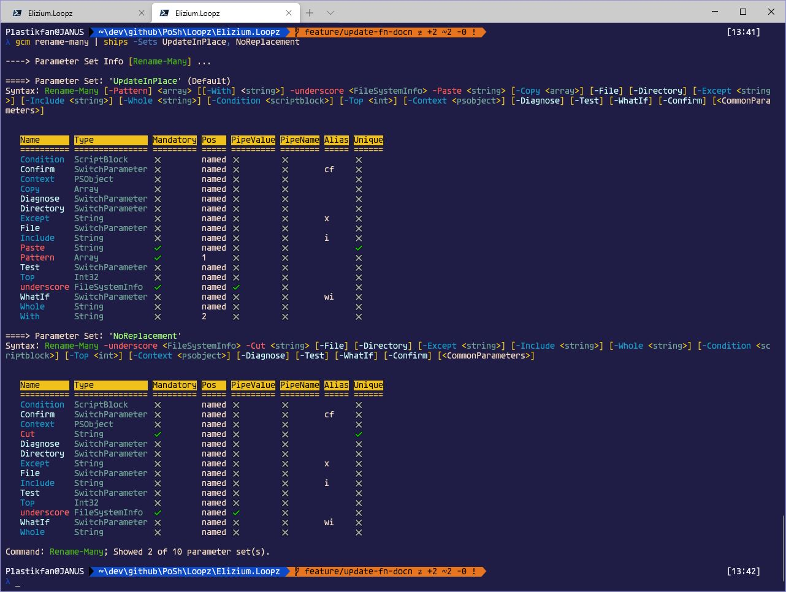

# :nazar_amulet: Elizium.Loopz Parameter Set Tools

---

## Using the Parameter Set Tools

There are 3 commands that comprise the parameter set tools, the first is a general query command and the others are reports that show violations/problems.

| Command Name              | Alias
|---------------------------|---------------------------------------------------------------
| Show-ParameterSetInfo     | ships [:heavy_check_mark:](#using.show-parameter-set-info) :heavy_plus_sign: | [:heavy_check_mark:](#krayon.message) :heavy_plus_sign:
| Show-ParameterSetReport   | sharp [:heavy_check_mark:](#using.show-parameter-set-report) :heavy_plus_sign: | [:heavy_check_mark:](#krayon.messagenosuffix) :heavy_plus_sign:
| Show-InvokeReport         | shire [:heavy_check_mark:](#using.show-invoke-report) :heavy_plus_sign: | [:heavy_check_mark:](#krayon.messageln) :heavy_plus_sign:

### Show-ParameterSetInfo

<div id="using.show-parameter-set-info"></div>

:dart: using *Show-ParameterSetInfo (ships)*

Show all the parameter information for a command. For brevity, this example supplies the names of some parameter sets, otherwise all parameter sets would be shown which in this case would be rather verbose.

> Get-Command 'Rename-Many' | ships -Sets UpdateInPlace, NoReplacement



### Show-ParameterSetReport

<div id="using.show-parameter-set-report"></div>

:dart: using *Show-ParameterSetReport (sharp)*

**Does a command satisfy all parameter set rules? If not, which rules does it violate and why**. These are the questions that this command answers. For a command that is well defined, we expect no violations to be reported as illustrated in the following example:

> Get-Command 'Rename-Many' | sharp


However, there are currently 4 rules that could be violated and these are illustrated next.

+ 1) :x: *Must Contain Unique Set Of Params*
No two parameter sets can contain exactly the same set of parameters.


In this example, we can see we have 1 violation. That is, there are two parameter sets 'Alpha' and 'Beta' which have the same set of parameters and therefore can't be disambiguated by PowerShell. Since the 2 parameters are equivalent, it goes on to show the parameter set info for the first parameter set only, 'Alpha'.

+ 2) :x: *Must Contain Unique Positions*


Parameters must make unique claims to a position within any single parameter set. In this example, we can see that in parameter set 'Alpha', there are 3 parameters 'DuplicatePosA', 'DuplicatePosB' and 'DuplicatePosC' making claim to position 999. In parameter set 'Beta', both 'SameA' and 'SameB' stake a claim to position 111.

+ 3) :x: *Must Not Have Multiple Pipeline Params*


There are 2 violations here. In parameter set 'Alpha', there are four parameters defined with *ValueFromPipeline* set to $true and three parameters in parameter set 'Beta', likewise.

+ 4) :x: *Must Not Be In All Parameter Sets By Accident*


Tbd.

### Show-InvokeReport

<div id="using.show-invoke-report"></div>

:dart: using *Show-InvokeReport (shire)*

**I am having trouble invoking a command. Which parameter set do my invoke parameters resolve to and if ambiguous, what is the set of candidate parameter sets that these parameters could relate to?**

In particular, when this message is seen in the console:

*"Parameter set cannot be resolved using the specified named parameters. One or
more parameters issued cannot be used together or an insufficient number of
parameters were provided."*

it would be nice to get a little more insight into the reason why the supplied parameters are incorrect. This command aims to help in this regard.

When *Show-InvokeReport* is invoked with a valid set of invoke parameters, the command shows which parameter set is resolved to:

> Get-Command Rename-Many | Show-InvokeReport -Params underscore, Pattern, Paste


## Parameter Set Classes

### Dry Runner Class

The Dry-Runner is used by the Show-InvokeReport command. The DryRunner can also
be used in unit-tests to ensure that expected parameters can be used to
invoke the function without causing errors. In the unit tests, the client just needs
to instantiate the DryRunner using [New-DryRunner](#New-DryRunner.md) then pass in an expected list
of parameters to the Resolve method. The test case can review the result parameter
set(s) and assert as appropriate.

The following example shows how to use the DryRunner in a unit test

```powershell
  Context 'given: a command with parameter sets' {
    Context 'and: valid set of parameters' {
      It 'should: resolve to a single parameter set' {
        [hashtable]$signals = Get-Signals;
        [Scribbler]$scribbler = New-Scribbler -Test;
        [string]$commandName = 'Rename-Many';

        [DryRunner]$runner = New-DryRunner -CommandName $commandName `
          -Signals $signals -Scribbler $scribbler;

        [CommandParameterSetInfo[]]$paramSets = $runner.Resolve(
          @('underscore', 'Pattern', 'Anchor', 'Paste')
        );

        $paramSets.Count | Should -Be 1;
      }
    }
  }
```

### Rule Controller Class

The RuleController class can be used in unit tests to check that commands do not violate the
parameter set rules.

```powershell
  Context 'given: commands under test' {
    It 'should: not violate parameter set rules' {
      using namespace System.Management.Automation;
      using module Elizium.Krayola;

      [hashtable]$signals = Get-Signals;
      [Scribbler]$scribbler = New-Scribbler -Test;

      [string]$directoryPath = './path-to-folder-with-commands-to-test';
      [array]$files = Get-ChildItem -Path $directoryPath -File -Recurse -Filter '*.ps1';

      foreach ($file in $files) {
        [string]$command = [System.IO.Path]::GetFileNameWithoutExtension($file.Name);
        [CommandInfo]$commandInfo = Get-Command $command -ErrorAction SilentlyContinue;

        if ($commandInfo) {
          [RuleController]$controller = [RuleController]::new($commandInfo);
          [syntax]$syntax = New-Syntax -CommandName $command -Signals $signals -Scribbler $scribbler;
          [PSCustomObject]$testResult = $controller.Test($syntax);

          [string]$because = $("'{0}' contains violations" -f $command);
          $testResult.Result | Should -BeTrue -Because $because;
        }
      }
    }
  }
```

## Syntax Class

The Syntax instance is a supporting class for the parameter set tools. It contains
various formatters, string definitions and utility functionality. The primary feature
it contains is that relating to the colouring in of the standard syntax statement
that is derived from a commands parameter set.

---

sample:


