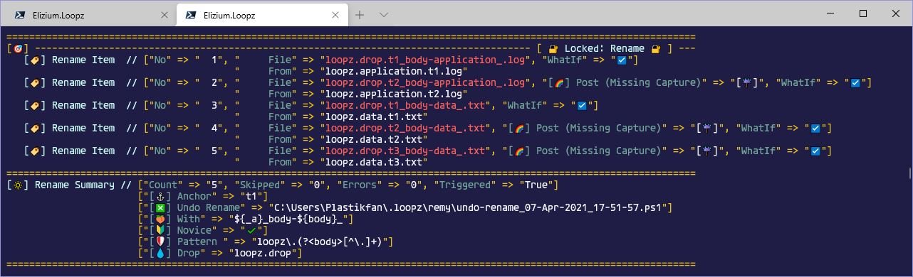

# :nazar_amulet: Elizium.Loopz Bulk Renamer

:high_brightness: **Rename-Many** (*remy*) is a flexible regular expression based bulk rename command. In order to get the best out of this command, the user should become familiar and skilled in writing regular expressions.

:pushpin: Note, that it is recommended that this page is read in sequential order, in particular because the first usage scenario to be explained: [Move Match](#action.move-match), includes more screen snapshots and examples to help explain the concepts, which is not repeated to the same detail in subsequent usage scenarios.
See also the [Parameter Reference](#parameter-reference), for a more detailed explanation of each parameter and
[Safety Features](#general.safety-features) to see how to *Unlock* the command so it becomes effective.

There are multiple modes of operation that Rename-Many runs in, which are *Update*/*Move*/*Cut*/*Appendage*. On top of this, a developer can extend it capabilities by providing a custom *Transform* function explained here.

| Mode                                   | DESCRIPTION
|----------------------------------------|---------------------------------------------
| [Move Match](#action.move-match)       | Move a regular expression match to an anchor
| [Update Match](#action.update-match)   | Replace a regular expression match
| [Cut Match](#action.cut-match)         | Remove a regular expression match
| [Add Appendage](#action.add-appendage) | Add a fixed token to Start or End of item
| [Transform](#action.transform)         | Apply a custom transform to perform rename

## :sparkles: General Concepts

### :gem: Safety features

Rename-Many is a powerful command and should be used with caution. Because of the
potential of accidental misuse, a number of protections have been put in place:

* By default, the command is locked. This means that the command will not actually
perform any renames until it has been unlocked by the user. When locked, the command
runs as though *WhatIf* has been specified. There are indications in the output to show
that the command is in a locked state (there is an indicator in the batch header and
a 'Novice' indicator in the summary). To activate the command, the user needs to
set the environment variable 'LOOPZ_REMY_LOCKED' to $false; ie ($env:LOOPZ_REMY_LOCKED = $false, either temporarily in the session, or permanently in the powershell profile, see $Profile). The user should not
unlock the command until they are comfortable with how to use this command properly
and knows how to write regular expressions correctly. (See regex101.com)

* An undo script is generated by default. If the user has invoked a rename operation
by accident without specifying *WhatIf* (or any other *WhatIf* equivalent like *Diagnose*)
then the user can execute the undo script to reverse the rename operation. The user
should clearly do this immediately on recognising the error of their ways. In a panic,
the user may terminate the command via ctrl-c. In this case, a partial undo script is
still generated and should contain the undo operations for the renames that were
performed up to the point of the termination request.
The name of the undo script is based upon the current date and time and is displayed
in the summary. (The user can, if they wish disable the undo feature if they don't want
to have to manage the accumulation of undo scripts, by setting the environment variable
LOOPZ_REMY_UNDO_DISABLED to $true.)

### :gem: Occurrence

All regular expression parameters as listed below ...

| Regex Parameter                           | Alias | DESCRIPTION
|-------------------------------------------|-------|------------------------------------------------------------------
| [Anchor](#parameter-ref.anchor)           | a     | [:heavy_check_mark:](blah) Where to move match to
| [AnchorEnd](#parameter-ref.anchorend)     | ae    | [:heavy_check_mark:](blah) Move match to end if item does not match
| [AnchorStart](#parameter-ref.anchorstart) | as    | [:heavy_check_mark:](blah) Move match to start if item does not match
| [Copy](#parameter-ref.copy)               | co    | [:heavy_check_mark:](blah) Make a copy of this match for formatter reference
| [Cut](#parameter-ref.cut)                 | :heavy_multiplication_x:      | [:heavy_check_mark:](blah) Remove this match without a replacement
| [Except](#parameter-ref.except)           | x     | [:heavy_check_mark:](blah) Filter out items that match
| [Include](#parameter-ref.include)         | i     | [:heavy_check_mark:](blah) Filter in items that match
| [Pattern](#parameter-ref.pattern)         | w     | [:heavy_check_mark:](blah) Replace or Move this match

... are all declared as arrays. This allows the user to augment the regular expression with an additional value denoting which match occurrence is in effect. This value can be either numeric which denotes which match to select or 'f' for the first match or 'l' indicating the last match. The exception to the use of the *Occurrence* value is with *Include*/*Except*, which are filtering parameters (see the following section). Since they are used for filtering, the *Occurrence* value is irrelevant, so should not be supplied.

So for example the *Pattern* can be specified as:

> Rename-Many -Pattern 'foo', 2 ...

This means that the second occurrence of the match 'foo' should be taken as the token match for each item being renamed.

### :gem: Filtering

Generally, the user must indicate which items are to be renamed using the pipeline. Any command can be used to select file system items (directories or files), but typically *Get-ChildItem* would be used and the result then piped to Rename-Many. *Get-ChildItem* contains a *Filter* parameter but this can only filter as a blob using wildcards where appropriate, but can not filter by a regular expression. The user could use an extra pipeline stage using Where-Object eg:

> Get-ChildItem -LiteralPath ./ -File -Filter '*.log' | Where-Object { $_.Name -match 'bar' } | Rename-Many ...

However, this command is starting to get quite long. So instead, Rename-Many contains regex filters via the *Include*/*Except* parameters:

> Get-ChildItem -LiteralPath ./ -File -Filter '*.log' | Rename-Many -Include 'bar' ...

and similarly for *Except*.

Any items filtered out 'inband' (by the filter parameters on *Rename-Many* as opposed to 'out of band' filtering applied to the previous stage of the pipeline, eg the filter parameter on Get-ChildItem), will be counted as a 'Skipped' item in the Summary displayed at the end of the rename batch.

### :gem: Formatter Parameters

The following parameters are known as *formatters*. This means that they are strings which contain the replacement text for the match. The formatter can also reference named (or numbered) group references defined in the non-filtering regex parameters:

| Formatter Parameter           | Alias | DESCRIPTION
|-------------------------------|-------|------------------------------------------------------------------
| [With](#parameter-ref.with)   | w     | [:heavy_check_mark:](blah) used when performing *Move*
| [Paste](#parameter-ref.paste) | ps    | [:heavy_check_mark:](blah) used when performing in place *Update*

So given the following as an example (not all parameters have been defined so do not take this as a literal example)

> ... | Rename-Many -Pattern '(?\<y\>\d{4})-(?\<m\>\d{2})-(?\<d\>\d{2})' -With '${d}-${m}-${y}'

we can see that inside the *With* formatter, there are references to named group captures ('y', 'm', 'd') that are defined inside the *Pattern* regex.

### :gem: General Parameters

The following parameters belong to all *Rename-Many* parameter sets:

(The parameters marked as *Interactive* are those which are meant to be used interactively. The other parameters are intended for use by developers needing to expand the renaming possibilities of the command.)

| General Parameter                     | Alias | Interactive (non Developer)  | DESCRIPTION
|---------------------------------------|-------|------------------------------|-----------------------------------
| [Condition](#parameter-ref.condition) |       | [:x:](blah)                  | A custom predicate script-block that filters pipeline items
| [Context](#parameter-ref.context)     |       | [:x:](blah)                  | A PSCustomObject with options to customise Rename-Many
| [Directory](#parameter-ref.directory) | d     | [:heavy_check_mark:](blah)   | Filter for Directory items only
| [Diagnose](#parameter-ref.diagnose)   | dg    | [:heavy_check_mark:](blah)   | WhatIf mode with added diagnostic info
| [End](#parameter-ref.end)             | e     | [:heavy_check_mark:](blah)   | Move Pattern
| [Except](#parameter-ref.except)       | x     | [:heavy_check_mark:](blah)   | Filter out items that match this regex
| [File](#parameter-ref.file)           | f     | [:heavy_check_mark:](blah)   | Filter for File items only
| [Include](#parameter-ref.include)     | i     | [:heavy_check_mark:](blah)   | Filter out items that do not match this regex
| [Start](#parameter-ref.start)         | s     | [:heavy_check_mark:](blah)   | Move matched Pattern to start of items name
| [Top](#parameter-ref.top)             | t     | [:heavy_check_mark:](blah)   | Process the first n items only
| [Transform](#parameter-ref.transform) |       | [:x:](blah)   | A script-block to perform custom rename operation
| [Whole](#parameter-ref.whole)         |       | [:heavy_check_mark:](blah)   | Applies 'whole word' match to regex parameters

### :gem: Post Processing

During the renaming process, an item maybe renamed resulting in unfavourable characteristics in the resultant file/directory name. Eg, it is not wise to leave a file name with trailing or leading spaces. The following are the characteristics that are automatically fixed by a post processing operation:

* Leading/Trailing spaces (*Trim*)
* Multiple consecutive spaces (*Spaces*)
* Unresolved named capture groups (*MissingCapture*)

For *Trim* and *Spaces*, the post processing simply involves removal of the unwanted spaces. For *MissingCapture* this process involves the removal of any string of the form:

> ${some-variable}

which occurs as a result of a named group reference defined in a formatter parameter (*With*/*Paste*) not being populated as a result of applying a regex parameter to the item and it not matching. An example of this occurring is with the use of a [Hybrid Anchor](#tbd) (*HybridStart*/*HybridEnd*), where the user specifies a pattern that includes a named group capture, but for some items, this match may fail (so by design, the match would fall back to being moved to start or end), but the formatter parameter *With* contains a reference to that named capture group. When this match fails, the reference '${some-variable}' still remains, which is removed by the post processing operation.

These post-processing operations are made explicit in the ui because **sometimes** they occur as a result of
a mal-formed regular expression that can be automatically fixed, but doing so may lure the user into thinking they're specifying the regex pattern correctly when in fact a minor correctable mistake has been made. It is best to be explicit about such issues rather than fix them silently.

The following shows an example of the *MissingCapture* operation being applied and how it shows up in the output:

### :gem: Signals

As the saying goes, 'a picture is worth a thousand words'. This is particularly cogent when eye-balling a stream of repetitive content generated as a result of an iterative operation such as the result of *Rename-Many*. Viewing and trying to process a wall of mono-coloured un-structured content can be difficult. This was the rationale behind the use of emojis (generalised into the concept of a *Signal* in commands) and of another Elizium PowerShell module [Krayola](https://github.com/EliziumNet/Krayola). The combination of coloured, consistently structured text with the use of emoji based signals is intended to aid human readability of repetitive content.

### :gem: The Replacement Process

For those parameter sets that require the *Pattern* parameter (which is most of them; *NoReplacement* which uses the *Cut* parameter does not), the content that is matched by the Pattern, is removed prior to applying other regex parameters.

It is useful for the user to think about this when composing regex patterns. For for example, given the following input source:

> 01-From-My-Mind-To-Yours

... a *Pattern* defined as:

> '\d{2}-'

results in first, the removal of the *Pattern* match leaving this behind:

> From-My-Mind-To-Yours

It is to this remainder that all other regex parameters are applied.

### :gem: Saved Undo Scripts

The undo facility enables a rename batch to be reversed. The location of the scripts is displayed in the rename summary. By default, scripts are saved to '.loopz' under the home ($Home) directory, but this can be overridden.

To change this path, the user should define either an absolute or relative path in the environment variable 'LOOPZ_PATH'. Relative paths are relative to the $Home directory.

## :sparkles: Move Match

| Move Parameter                            | Alias | DESCRIPTION
|-------------------------------------------|-------|-------------------------------------
| [Anchor](#parameter-ref.anchor)           | a     | Move a regular expression match to an anchor
| [AnchorEnd](#parameter-ref.anchorend)     | ae    | Move a regular expression match to an anchor
| [AnchorStart](#parameter-ref.anchorstart) | as    | Move a regular expression match to an anchor
| [End](#parameter-ref.end)                 | e     | Remove a regular expression match
| [Start](#parameter-ref.start)             | s     | Replace a regular expression match
| [With](#parameter-ref.anchor)             | w     | Formatter used when performing *Move*

Moves a match from it's current location in an item to a target location known as the Anchor. The anchor itself is a regular expression. All of the parameters with the exception of *With* are mutually exclusive (to see confirmation of this, the user can use the [Parameter Set Tools](parameter-set-tools.md) in particular the command [Show-ParameterSetInfo (ships)](#parameter-set-tools.md/using.show-parameter-set-info), which reveal that there are indeed the unique parameters in their respective parameter sets).

### :gem: Move to Anchor

Move a regex match identified by *Pattern* from the items' name from its current location to a location specified by the *Anchor* regex pattern.

Let's say we have a bunch of audio files which are currently named in the form:

> \'<DISC-NO\>-\<TRACK-NO\>\_\<TRACK-NAME\>.mp3'

(the underscore used in all examples are meant to represent a single space)

... and we wish to move the *DISC-NO* to after the *TRACK-NO*. In this case, the *DISC-NO* would be the subject of the *Pattern* match and the *TRACK-NO* would be the *Anchor*.

So an initial attempt of the command could be:

> gci ... | Rename-Many -Pattern '\d{2}' -Anchor '\d{2}' -WhatIf

:pushpin: At the end of this section a final version of the command will be illustrated, but we will get there in small steps, so that little nuances can be explained fully.

Focusing on a single file item in the batch being: '**02-09 Radio Stars.mp3**':

* **02** represents the *DISK-NO*
* **09** represents the *TRACK-NO*
* **Radio Stars** represents the *TRACK-NAME*

:heavy_minus_sign: Rename-Many -Pattern '\d{2}' -Anchor '\d{2}' -WhatIf

> -0902 Radio Stars.mp3

Although the order of the *DISC-NO* and *TRACK-NO* have been swapped around, this is almost certainly not what we would want. We need to maintain the dash in between them. We can't include the dash inside the *Pattern* because that would just result in '0902-'. This is where the *With* formatter parameter and *Relation* comes into play. We can format the replacement text:

:heavy_minus_sign: Rename-Many -Pattern '\d{2}' -Anchor '\d{2}' -With '${_a}-$0' -WhatIf

> -09-02 Radio Stars.mp3

This is starting to get better, but there is still a problem. We now have a stray leading dash, but before discussing that issue, the contents of the [With](#parameter-ref.with) parameter needs explaining. Formatter parameters can access whole regex captures defined by other parameters and/or named/numeric capture groups defined within them. So in this example '$0' represents the whole [Pattern](#parameter-ref.pattern) match which evaluates to '02' and ${_a} represents the whole [Anchor](#parameter-ref.anchor) match which evaluates to '09'.

So back to the issue at hand, being the leading stray '-'. We could solve this 1 of 2 ways

* 1️⃣ capture the dash inside the *Pattern*, but also inside the *Pattern*, the characters that we really want to preserve now need to be inserted into a named capture group, so that they can be individually addressed without the whole *Pattern match*. Inside *With*, we replace '$0', with the named capture group 'disc', referenced as '${disc}':

:radio_button: -Pattern '(?\<disc\>\d{2})-' -Anchor '\d{2}' -With '${_a}-${disc}' -WhatIf

> 09-02 Radio Stars.mp3

* 2️⃣ capture the dash inside the *Anchor* and use the same technique for 1️⃣ above. This time, inside *With*, we replace ${_a}, with the named capture group 'track', referenced as '${track}':

:radio_button: -Pattern '\d{2}' -Anchor '-(?\<track\>\d{2})' -With '${track}-$0' -WhatIf

> 09-02 Radio Stars.mp3

Finally, we might decide that the \<TRACK-NO\>-\<DISC-NO\> sequence needs to be more clearly separated from the \<TRACK-NAME\>, so an extra ' - ' is inserted into *With*, let's say using technique 1️⃣ above (but equally applies to 2️⃣):

:heavy_plus_sign: -Pattern '(?<disc>\d{2})-' -Anchor '\d{2}' -With '${_a}-${disc} - ' -WhatIf

> 09-02 - Radio Stars.mp3

Now that we have our somewhat finalised version, lets see how this looks in a batch:

(actually, the screen shot below uses the [Top](#parameter-ref.top) parameter to reduce the number of item processed, for brevity)

It can be seen that for each item renamed, the new name is displayed in red, with the original name displayed it in white. Next to the new name, supplementary info is displayed, including 'Post (Spaces)' (we'll come to this a little later) and a *WhatIf* indicator.

At the beginning of the batch, a title is shown with the [Locked](#general.safety-features) status highlighted. At the end of the batch, the rename summary is shown, displaying the value of key parameter values and some stats.

The 'Post (Spaces)' previously mentioned, indicates we have made a slight formatting error that has been fixed automatically for us by [Post Processing](#general.post-processing). In this case we have created a *With* formatter that results in consecutive spaces in the resultant rename.

So looking at our definition of *With* again:

> -With '${_a}-${disc} - '

That space at the end is our issue. There is already a space preceding the \<TRACK-NAME\> which was not captured by either *Pattern* or *Anchor*, so we don't need to insert another. So adjusting this to be

> -With '${_a}-${disc} -'

... without the trailing space, fixes the problem:

:heavy_plus_sign: -Pattern '(?<disc>\d{2})-' -Anchor '\d{2}' -With '${_a}-${disc} -' -Top 10 -WhatIf

The *Post Processing* is there to watch our back by automatically enforcing desirable rules and makes the command less pedantic in its operation.

In other more complicated rename batches, we might (and probably will) encounter a scenario where the named group captures defined are not doing what we expected. In this case, we can run the command with diagnostics enabled via the [Diagnose](#parameter-ref.diagnose) parameter.

For this example, we can see when *Diagnose* is specified, we can see the value of named capture groups:

Focusing on the first entry, item named '01-01 Autobahn.mp3', we can see the diagnostics entry:

> "[🧪] Pattern" => "([☂️] \<disc\>)='01', ([☂️] <0>)='01-'"

This tells us that *Pattern* contains named group reference(s), in this case:

* 'disc': '01'
* $0: '01-'

This is quite a convenient and tidy example, because all the input items are of identical form, but this is not always the case. Let's assume, the first entry in this list: '01-01 Autobahn.mp3' is not named that way, instead it is '01-0 Autobahn.mp3' so the track number is now just a single digit '0'.

In this case, the *Pattern* will match because there is still a 2 digit sequence, but the *Anchor* will no longer match. This results in this item not being renamed and this is indicated in the output:

The final point worthy of note is the 'Undo Rename' in the summary. By default, all executed commands are *undo-able*. If we find that after running the command (assuming it has been unlocked and *WhatIf* is not specified), the results are not as envisioned (shouldn't really happen, because the *WhatIf* should always be used for new executions), the rename can be undone.

The summary contains a [path](#general.saved-undo-scripts) to an undo script under the 'Undo Rename' signal. The user can review its contents first (recommended before running any scripts on a system) and then source that file. The undo script is purely a sequence of renames in reverse with the original name and new names swapped around, thereby reversing the whole batch.

### :gem: Move to Start

Move a regex match identified by *Pattern* from the items' name from its current location to the start of an item's name.

### :gem: Move to End

Move a regex match identified by *Pattern* from the items' name from its current location to the end of an item's name.

### :gem: Move to Hybrid Anchor

In the rename batch, some items may match the *Anchor* pattern and others may not. Ordinarily, if the *Anchor* does not match, then the rename will not occur for this item. This would then require the user to re-run the command with a redefined anchor or run with an entirely different parameter set. However, with a **Hybrid Anchor**, what we're saying is:

*If the specified anchor fails to match, then move the match to the Start or End*

So using a hybrid anchor allows the user to perform an anchor oriented operation with a backup if the anchor doesn't match, all in the same batch.

## :sparkles: Update Match

| Update Parameter         | Alias | DESCRIPTION
|--------------------------|-------|------------------------------------------------------------------
| [Paste](#tbd)            | ps    | [:heavy_check_mark:](blah) Formatter used when performing in place *Update*

## :sparkles: Cut Match

| Regex Parameter          | Alias | DESCRIPTION
|--------------------------|-------|------------------------------------------------------------------
| [Cut](#tbd) | :heavy_multiplication_x:      | [:heavy_check_mark:](blah) Remove this match without a replacement

## :sparkles: Add Appendage

### Add Prefix

| Prefix Parameter         | Alias | DESCRIPTION
|--------------------------|-------|------------------------------------------------------------------
| [Prepend](#tbd)          | pr    | [:heavy_check_mark:](blah) Prefix items' name with this literal string

### Add Suffix

| Suffix Parameter         | Alias | DESCRIPTION
|--------------------------|-------|------------------------------------------------------------------
| [Append](#tbd)           | ap    | [:heavy_check_mark:](blah) Append this literal string to items' name

## :sparkles: Transform

## :sparkles: Parameter Reference

### :dart: Anchor

**Type**: [string](regular expression, string)

Indicates that the rename operation will be a move of the token from its original point
to the point indicated by [Anchor](#parameter-ref.anchor). *Anchor* is a regular expression string applied to the pipeline item's name (after the *Pattern* match has been removed). The [Pattern](#parameter-ref.pattern) match that is removed is inserted at the position indicated by the anchor match in collaboration with
the [Relation](#parameter-ref.relation) parameter.

### :dart: AnchorEnd

**Type**: [string](regular expression, string)

Similar to [Anchor](#parameter-ref.anchor) except that if the pattern specified by *AnchorEnd* does not match, then the [Pattern](#parameter-ref.pattern) match will be moved to the end. This is known as a **Hybrid Anchor**.

### :dart: AnchorStart

**Type**: [string](regular expression, string)

Similar to [Anchor](#parameter-ref.anchor) except that if the pattern specified by *AnchorStart* does not match, then the [Pattern](#parameter-ref.pattern) match will be moved to the start. This is known as a **Hybrid Anchor**.

### :dart: Append

**Type**: [string]

Appends a literal string to end of item's name.

### :dart: Condition

**Type**: [ScriptBlock] (predicate)

Provides another way of filtering pipeline items. This is not typically specified on the
command line, rather it is meant for those wanting to build functionality on top of *Rename-Many*.

### :dart: Context

**Type**: [PSCustomObject]

Provides another way of customising *Rename-Many*. This is not typically specified on the
command line, rather it is meant for those wanting to build functionality on top of *Rename-Many*.
*Context* should be a PSCustomObject with the following note properties:

* Title (default: 'Rename') the name used in the batch header.
* ItemMessage (default: 'Rename Item') the operation name used for each renamed item.
* SummaryMessage (default: 'Rename Summary') the name used in the batch summary.
* Locked (default: 'LOOPZ_REMY_LOCKED) the name of the environment variable which controls
the locking of the command.
* DisabledEnVar (default: 'LOOPZ_REMY_UNDO_DISABLED') the name of the environment variable
which controls if the undo script feature is disabled.
* UndoDisabledEnVar (default: 'LOOPZ_REMY_UNDO_DISABLED') the name of the environment
variable which determines if the Undo feature is disabled. This allows any other function
built on top of Rename-Many to control the undo feature for itself independently of
Rename-Many.

### :dart: Copy

**Type**: [array]

Regular expression string applied to the pipeline item's name (after the [Pattern](#parameter-ref.pattern) match has been removed), indicating a portion which should be copied and re-inserted (via the
format parameters [Paste](#parameter-ref.paste) and [With](#parameter-ref.with)). Since this is a regular expression to be used in *Paste*/*$With*, there is no value in the user specifying a static pattern, because that literal string can just be defined in *Paste*/*$With*. The value in the *Copy* parameter comes
when a generic pattern is defined eg \d{3} (is non Literal), specifies any 3 digits as
opposed to say '123', which could be used directly in the formatter parameters without
the need for *Copy*. The match defined by *Copy* is stored in special variable ${_c} and
can be referenced as such from *Paste* and *$With*.

### :dart: Cut

**Type**: [array]

Is a replacement for the [Pattern](#parameter-ref.pattern) parameter, when a *Cut* operation is required. The pattern match will be removed from the item's name and no other replacement occurs.

### :dart: Diagnose

**Type**: [switch]

Indicates the command should be run in *WhatIf* mode. When enabled, it presents additional information that assists the user in correcting the un-expected results caused by an incorrect/un-intended regular expression. The current diagnosis will show the contents of named capture groups that they may have specified. When an item
is not renamed (usually because of an incorrect regular expression), the user can use the diagnostics along side the 'Not Renamed' reason to track down errors. When *Diagnose* has been specified, *WhatIf* does not need to be specified.

### :dart: Directory

**Type**: blah

Indicates only Directory items in the pipeline will be processed. If neither this switch or the [File](#parameter-ref.file) switch are specified, then both File and Directory items are processed.

### :dart: Drop

**Type**: [string]

Only applicable to move operations. Defines what text is used to replace the [Pattern](#parameter-ref.pattern) match with. So in this use-case, the user wants to move a particular token/pattern to another part of the name and at the same time drop a static string in the place where the *Pattern* was removed from.

### :dart: End

**Type**: [switch]

Is another type of anchor used instead of [Anchor](#parameter-ref.anchor) and specifies that the [Pattern](#parameter-ref.pattern) match should be moved to the end of the new name.

### :dart: Except

**Type**: [string](regular expression, string)

Regular expression string applied to the original pipeline item's name (before the [Pattern](#parameter-ref.pattern) match has been removed). Allows the user to exclude some items that have been fed in via the
pipeline. Those items that match the exclusion are skipped during the rename batch.

### :dart: File

**Type**: [switch]

Indicates only File items in the pipeline will be processed. If neither this switch or the [Directory](#parameter-ref.directory) switch are specified, then both *File* and *Directory* items are processed.

### :dart: Include

**Type**: [string](regular expression)

Regular expression string applied to the original pipeline item's name (before the [Pattern](#parameter-ref.pattern) match has been removed). Allows the user to include some items that have been fed in via the
pipeline. Only those items that match *Include* pattern are included during the rename batch,
the others are skipped. The value of the *Include* parameter comes when you want to define
a pattern which pipeline items match, without it be removed from the original name, which is
what happens with *Pattern*. Eg, the user may want to specify the only items that should be
considered a candidate to be renamed are those that match a particular pattern but doing so
in *Pattern* would simply remove that pattern. That may be ok, but if it's not, the user should
specify a pattern in the *Include* and use *Pattern* for the match you do want to be moved
(with the anchor parameters) or replaced (with the formatter parameters).

### :dart: Paste

**Type**: [string]

When *Paste* is defined, the [Anchor](#parameter-ref.anchor) (if specified) is removed from the original name and needs to be be re-inserted using the special variable ${_a}. The other special variables that can be used inside a *Paste* string is documented under the [With](#parameter-ref.with) parameter. The *Paste* string can specify a format that defines the replacement and since it removes the *Anchor*, the [Relation](#parameter-ref.relation) is not applicable.

### :dart: Pattern

**Type**: [array](regular expression, string)

Regular expression string that indicates which part of the pipeline items' name that
either needs to be moved or replaced as part of bulk rename operation. Those characters
in the name which match are removed from the name.

### :dart: Prepend

**Type**: [string]

Prefixes a literal string to start of item's name.

### :dart: Relation

**Type**: [string]("before" | "after")

Used in conjunction with the [Anchor](#parameter-ref.anchor) parameter and can be set to either 'before' or
'after' (the default). Defines the relationship of the [Pattern](#parameter-ref.pattern) match with the *Anchor* match in the new name for the pipeline item.

### :dart: Start

**Type**: [switch]

Another type of anchor used instead of [Anchor](#parameter-ref.anchor) and specifies that the [Pattern](#parameter-ref.pattern) match should be moved to the start of the new name.

### :dart: Test

**Type**: [switch]

Indicates if this is being invoked from a test case, so that the
output can be suppressed if appropriate. By default, the test cases should be
quiet. During development and test stage, the user might want to see actual
output in the console. The presence of variable 'EliziumTest' in the
environment will enable verbose tests. When invoked by an interactive user in
production environment, the Test flag should not be set. Doing so will suppress
the output depending on the presence 'EliziumTest'. **ALL** test cases should
specify this Test flag.

### :dart: Top

**Type**: [int]

A number indicating how many items to process. If it is known that the number of items
that will be candidates to be renamed is large, the user can limit this to the first *Top*
number of items. This is typically used as an exploratory tool, to determine the effects
of the rename operation.

### :dart: Transform

**Type**: [ScriptBlock]

A script block which is given the chance to perform a modification to the finally named
item. The transform is invoked prior to post-processing, so that the post-processing rules
are not breached and the transform does not have to worry about breaking them. The transform
function's signature is as follows:

* Original: original item's name
* Renamed: new name
* CapturedPattern: pattern capture

and should return the new name. If the transform does not change the name, it should return
an empty string.

### :dart: underscore

**Type**: [FileSystemInfo]

The pipeline item which should either be an instance of FileInfo or DirectoryInfo.

### :dart: Whole

**Type**: [string]

Provides an alternative way to indicate that the regular expression parameters
should be treated as a whole word (it just wraps the expression inside \b tokens).
If set to '*', then it applies to all expression parameters otherwise a single letter
can specify which of the parameters 'Whole' should be applied to. Valid values are:

* 'p': $Pattern
* 'a': $Anchor/AnchorEnd/AnchorStart
* 'c': $Copy
* 'i': $Include
* 'x': $Except
* '*': All the above
(NB: Currently, can't be set to more than 1 of the above items at a time)

### :dart: With

**Type**: [string]

Formatter which defines what text is used as the replacement for the [Pattern](#parameter-ref.pattern)
match. Works in concert with [Relation](#parameter-ref.relation) (whereas [Paste](#parameter-ref.paste) does not). *With* can reference special variables:

* $0: the pattern match
* ${_a}: the anchor match
* ${_c}: the copy match

When *Pattern* contains named capture groups, these variables can also be referenced. Eg if the
*Pattern* is defined as '(?<day>\d{1,2})-(?<mon>\d{1,2})-(?<year>\d{4})', then the variables
${day}, ${mon} and ${year} also become available for use in *With* or *Paste*.

Typically, *With* is literal text which is used to replace the *Pattern* match and is inserted
according to the anchor parameters and *Relation*. When using *With*, whatever is defined in the *anchor* match is not removed from the pipeline's name (this is different to how *Paste* works).

## Troubleshooting / Common Errors

Most issues that occur with using *Rename-Many* is as the result of not defining a regex pattern correctly. These clearly can only be fixed, by reviewing the pattern and adjusting accordingly.

It is advised that users always run with *WhatIf* enabled for new invocations of Rename-Many, so that the results can be confirmed before being actioned for real. When unexpected results occur, the user can specify the *Diagnose* parameter to ensure that named capture groups are working as expected. Readers are also directed to use other 3rd party resources to debug regex patterns such as [regex101](https://regex101.com).

* incorrect use of double quotes on formatter parameters; use single quotes to avoid incorrect interpolation
* use PCRE compatible patterns. Eg, for named capture groups some regex engines use '(P?\<name\>)', this form will not work with Rename-Many, so make sure the correct syntax is being used in regex definitions.
* mixing up *Paste* with *With*

## Expanding Rename-Many Capabilities

### Higher Order Commands

Provides the facility to reuse the base *Rename-Many* functionality to build higher level functionality. Since regular expressions are not particularly easy to specify without prior skill and knowledge, it might be advantageous to build a high level command that wraps the base functionality and has embedded within it a commonly used combination of parameters and regular expression definitions. This way the high level version can hide-away difficult to remember regular expressions that are used on a regular basis.

To build a high level *Rename-Many* command, a developer should perform the following tasks:

* Define the contents of the [Context](#parameter-ref.context) parameter
* Define the regular expression and formatter parameters that need to be abstracted away and encapsulated
* The higher level command
